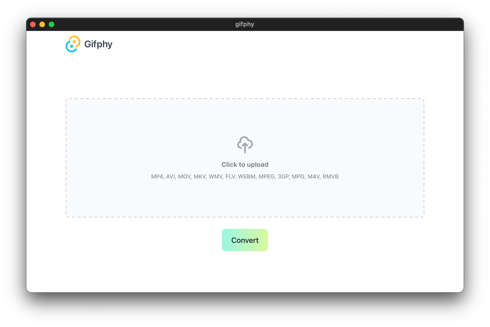

# Gifphy

Convert video to gif file

## Application

Download the latest portable 
[Linux](https://github.com/prongbang/gifphy/releases/tag/v1.0.1) / 
[MacOS](https://github.com/prongbang/gifphy/releases/tag/v1.0.1)
executable files.



## Native

```
$ bash ./gifphy.sh filename.mp4
```
